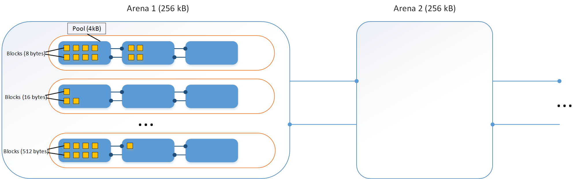

# Memory Management Notes

## Memory Management

Python allocates memory transparently, manages objects using a reference count 
system, and frees memory when an object’s reference count falls to zero.

Everything in Python is an object. Some objects can hold other objects (lists, tuples, dicts, classes, etc.). 
Because of dynamic Python's nature, such an approach requires a lot of small memory allocations. 
To speed-up memory operations and reduce fragmentation Python uses a special manager on top of the general-purpose allocator, called `PyMalloc`.

### Small Object Allocation

To reduce overhead for small objects (less than 512 bytes) Python sub-allocates big blocks of memory. 
Larger objects are routed to standard C allocator. Small object allocator uses three levels of abstraction: arena, pool, and block.

### Block

Block is a chunk of memory of a certain size. Each block can keep only one Python object of a fixed size. 
The size of the block can vary from 8 to 512 bytes and must be a multiple of eight (i.e., use 8-byte alignment). 
For convenience, such blocks are grouped in 64 size classes.

| Request in bytes | Size of allocated block | Size class idx |
|------------------|:-----------------------:|:--------------:|
| 1..8             | 8                       | 0              |
| 9..16            | 16                      | 1              |
| 17..24           | 24                      | 2              |
| ...              |                         |                |
| 505..512         | 512                     | 63             |

### Pool

A collection of blocks of the same size is called a pool. 
The size of the pool is equal to the size of a memory page (4Kb). 
Limiting pool to the fixed size of blocks helps with fragmentation. 
If an object gets destroyed, the memory manager can fill this space with a new object of the same size.

Pools of the same sized blocks are linked together using doubly linked list.

If a block is empty instead of an object, it stores an address of the next empty block. 
This trick saves a lot of memory and computation.

Each pool has three states:

- used — partially used, neither empty nor full
- full — all the pool's blocks are currently allocated
- empty — all the pool's blocks are currently available for allocation

> Pools and blocks are not allocating memory directly, instead, they are using already allocated space from arenas.

### Arena

The arena is a chunk of 256kB memory allocated on the heap, which provides memory for 64 pools.

All arenas are linked using doubly linked list.

Arena is like a list of containers, which automatically allocates new memory for pools when needed.

### Memory Deallocation

Python's small object manager rarely returns memory back to the Operating System.

An arena gets fully released if and only if all the pools in it are empty. 
For example, it can happen when you use a lot of temporary objects in a short period of time.

Speaking of long-running Python processes, they may hold a lot of unused memory because of this behavior.

Therefore, we should work hard to allocate only the number of small objects necessary
for one task, favoring loops where only a small number of elements are created/processed 
rather than patterns where lists are created using list generation syntax then processed.
In the last case, you end up creating lots of small objects that will come populate the 
small object lists, and even once the list is dead, the dead objects will still occupy a lot of
memory.

Occupied memory is still accessible to the Python program. But from the OS’s
perspective, your program's size is the total memory allocated to Python.
If you run on Linux, you may see the total memory used by your program increase.

## Object Sizes

### None Size

`None` size is **16 bytes**.

### Int Size

| Range        | Size (bytes) getsizeof | Size (bytes) asizeof |
|--------------|:----------------------:|:--------------------:|
| 0            | 24                     | 24                   |
| 1 .. 2^29    | 28                     | 32                   |
| 2^30 .. 2^59 | 32                     | 32                   |
| 2^60 .. 2^89 | 36                     | 40                   |

The same sizes are for negative integers.

Minimal size is **24 bytes**. It adds 4 bytes for every further `2**30` until memory gets exhausted. In case of `asizeof` it adds 8 bytes for every `2**60`.

TODO: unclear why there is a difference between `sys.getsizeof` and `pympler.asizeof`?

### Float Size

Float size is always **24 bytes**.

### Bool Size

| Value        | Size (bytes) getsizeof | Size (bytes) asizeof |
|--------------|:----------------------:|:--------------------:|
| False        | 24                     | 24                   |
| True         | 28                     | 32                   |

TODO: unclear why there is a difference between `sys.getsizeof` and `pympler.asizeof`?

### Bytes Size

Empty bytes object size is **33 bytes**.

It adds 1 byte for every next ASCII literal character for `sys.getsizeof`.

Non ASCII literal chars require encoding and take more bytes even if amount of chars are the same.

In case of `pympler.asizeof`: empty bytes object size is 40 bytes, it increments size by 8 bytes (1 byte per char).

### String Size

Empty string size is **49 bytes**.

It adds 1 byte for every next ASCII literal character for `sys.getsizeof`.

Non ASCII literal chars take more bytes even if amount of chars are the same.

In case of `pympler.asizeof`: empty bytes object size is 56 bytes, it increments size by 8 bytes (1 byte per char).

### Tuple Size

Empty tuple size is **40 bytes**.

It adds 8 bytes for every next item in the tuple no matter what type of object is. 
For example: `(1, 2)` size is 56 bytes.

In theory to calculate size of tuple with its contents: we have to sum up all objects that included into a tuple.

In case of `sys.getsizeof` it will be: 56 (tuple size for 2 items) + 28 (size of int=1) + 28 (size of int=2) = 112 bytes

`pympler.asizeof` gives slightly different result: 56 (tuple size for 2 items) + 32 (int size) + 32 (int size) = 120 bytes

### List Size

Empty list size is **56 bytes**.

As with tuples it also may add 8 bytes for every next item in the list no matter what type of object is. 
But in practice it looks like (TODO: see example), a list memory grows by 32, 64, 96 ... bytes block (4, 8, 12 ... items in it) 
if the list needs more memory. TODO: find out the size grow formula.

### Dict Size

Empty dict size is **64 bytes**.

TODO: unclear how dict size changes

### Set Size

Empty set size is **216 bytes**.

TODO: unclear how dict size changes
